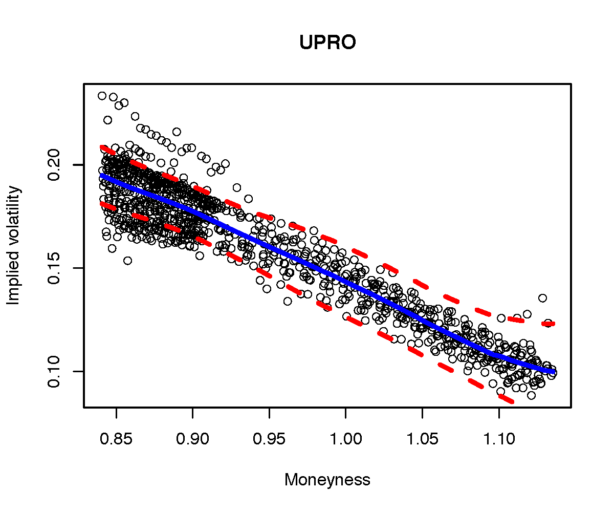

[](http://quantlet.de/index.php?p=info)

## [](http://quantlet.de/) **LETFConfBands07UPRO** [](http://quantlet.de/d3/ia)

```yaml

Name of Quantlet : LETFConfBands07UPRO

Published in : Leveraged ETF options implied volatility paradox

Description : 'Calculate and plot uniform bootstrap confidence bands for the ProShares UltraPro
S&P500 (UPRO) LETF option implied volatility at the time-to-maturity 0.7 years'

Keywords : 'confidence-bands, bandwidth, robust estimation, kernel, implied-volatility, uniform,
option, leverage effekt'

See also : 'LETFConfBands05SPY, LETFConfBands05SDS, LETFConfBands05SSO, LETFConfBands05UPRO,
LETFConfBands06SPY, LETFConfBands06SSO, LETFConfBands06UPRO, LETFConfBands06SDS,
LETFConfBands07SDS, LETFConfBands07SSO, LETFConfBands07UPRO'

Author : Sergey Nasekin

Submitted : 2016/01/19

Datafile : mivttmdata_07_UPRO.csv, mivttmdata_07_SPY.csv

Input: 
- B: number of bootstrap iterations
- alpha: 1-confidence level of the bands
- gridn: number of grid points for estimation
- beta: leverage ratio of the LETF

Output : plot of bootstrap uniform confidence bands around the true curve

```




```r
# clear variables and close windows
rm(list = ls(all = TRUE))
graphics.off()

#Load libraries 
libraries = c("foreach","MASS","quantreg","KernSmooth","doParallel")
lapply(libraries, function(x) if (!(x %in% installed.packages())) {
    install.packages(x)
})
lapply(libraries, library, quietly = TRUE, character.only = TRUE)
source("cbands_funcs.r")

## Parameters
cl       = 7     # Number of cores to use
B        = 1000
alpha    = 0.05
gridn    = 100
beta     = 3 #change here the beta for the LETF in question

# Load data and apply moneyness scaling
monivdataLETF = read.table('mivttmdata_07_UPRO.csv',sep=',')
monivdataSPY  = read.table('mivttmdata_07_SPY.csv',sep=',')
etfvol        = as.matrix(monivdataSPY[,2])
x             = as.matrix(monivdataLETF[,1])
y             = as.matrix(monivdataLETF[,2])/abs(beta)
ttm           = as.matrix(monivdataLETF[,3])
ScMonKf       = (x/exp(-0.5*beta*(beta-1)*(mean(etfvol)^2)*ttm))^(1/beta)
x             = ScMonKf

#Choose bandwidths
n  = nrow(x)
hg = 0.15
g  = n^(-1/9)

# Sort input data
y  = y[order(x)]
x  = x[order(x)]

# Scale x to [0, 1]
xmin = min(x)
xmax = max(x)
x    = (x - xmin) / (xmax - xmin)
h    = median(abs(x-median(x)))/0.6745*(4/3/n)^0.2

# Initial fit
yhat.h = lnrob(x, y, h = h, maxiter = 100, x0 = x)
yhat.g = lnrob(x, y, h = g, maxiter = 100, x0 = x)
ehat   = y - yhat.h$fv
ehh    = median(abs(ehat-median(ehat)))/0.6745*(4/3/n)^0.2

yhat.grid.h = lnrob(x, y, h = h, maxiter = 100, x0 = seq(0, 1, length.out = gridn))
yhat.grid.g = lnrob(x, y, h = g, maxiter = 100, x0 = seq(0, 1, length.out = gridn))


# Empirical pdf of x at gridpoints
fxd    = bkde(x, gridsize = gridn, range.x = c(yhat.grid.h$xx[1], yhat.grid.h$xx[gridn]))
fxdfin = bkde(x, gridsize = n, range.x = c(yhat.h$xx[1], yhat.h$xx[n]))

fl  = vector(length = gridn, mode = "numeric")
fll = vector(length = gridn, mode = "numeric")

for (k in 1: gridn){
    # Conditional pdf f(e|x)at gridpoints
    nom   = sum((kernelq((x - yhat.grid.h$xx[k]) / (hg)) *
                 yhat.grid.h$psi1((y - yhat.grid.h$fv[k]), deriv = 1)))
    denom = sum(kernelq((x - yhat.grid.h$xx[k])/(hg)))
    fl[k] = nom / denom
  
    # Conditional E(psi^2(e))
    nom    = sum((kernelq((x - yhat.grid.h$xx[k])/(h)) *
                  yhat.grid.h$psi1((y - yhat.grid.h$fv[k]), deriv = 0)^2))
    denom  = sum(kernelq((x -  yhat.grid.h$xx[k])/(hg)))
    fll[k] = nom / denom
}

bandt = (fxd$y)^(1/2) * abs(fl / sqrt(fll))

# Bootstrap
pack = c("MASS", "KernSmooth", "Rlab", "quantreg")
cl   = makeCluster(cl)
registerDoParallel(cl)

d    = vector(length = B, mode = "numeric")

d = foreach(i = 1:B, .packages = pack)%dopar%{
    estar   = lprq3( yhat.h$xx, (y - yhat.h$fv), h = hg, x0 = yhat.grid.h$xx )
    ystar   = yhat.grid.g$fv + estar$fv
    fitstar = lnrob(yhat.grid.h$xx, ystar, h = h, maxiter = 50, x0 = yhat.grid.h$xx )
    d.m     = max(abs(bandt*abs(fitstar$fv - yhat.grid.g$fv)))
}

stopCluster(cl)
d = unlist(d)

dstar = quantile(d[d!=0], probs = 1 - alpha)
dstar = dstar * {bandt}^(-1)

# Construct asymptotic confidence bands
cc     = 1 / 4
lambda = 1 / 2 / sqrt(pi)
delta  = - log(h) / log(n)
dd     = sqrt(2 * delta * log(n)) + (2 * delta * log(n))^(-1/2) * log(cc / 2 / pi)
cn     = log(2) - log(abs(log(1 - alpha)))
band   = (n * h)^(- 1/2) * bandt^{-1} * (dd + cn * (2 * delta * log(n))^(-1/2)) * sqrt(lambda)

# Scale back
x      = ( x              * (xmax - xmin) ) + xmin
x.grid = ( yhat.grid.h$xx * (xmax - xmin) ) + xmin

plot(x, y, xlab = "Moneyness", ylab = "Implied volatility", main = "UPRO")
lines(x.grid, yhat.grid.h$fv, lwd = 4, col = "blue")
lines(x.grid, (yhat.grid.h$fv - dstar), col = "red",   lty = 2, lwd = 4)
lines(x.grid, (yhat.grid.h$fv + dstar), col = "red",   lty = 2, lwd = 4)


```
