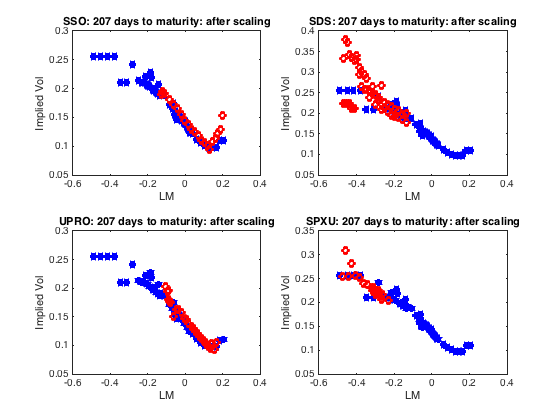

[](http://quantlet.de/index.php?p=info)

## [](http://quantlet.de/) **LETFIVMonSc** [](http://quantlet.de/d3/ia)

```yaml

Name of Quantlet : LETFIVMonSc

Published in : Leveraged ETF options implied volatility paradox

Description : 'Plot the implied volatilities for 4 leveraged ETFs versus the unleveraged SPY ETF
implied volatility after moneyness scaling'

Keywords : implied-volatility, option, european-option, moneyness, scaling, maturity

See also : LETFIV

Author : Sergey Nasekin

Submitted : 2016/02/01

Datafile : ivplotdata.mat

Example : plot of the implied volatilities for LETFs

```




```matlab
%% Load data

%Clear workspace and close all windows 
clc
clear
close all

load ivplotdata

rate   = 0.001;
tpoint = 182;
date   = datestr(dates(tpoint));

%calculate TTM
%16-Jan-2016 is the expiration date for the options here
dtm = daysact(date,'16-Jan-2016');
ttm = dtm/365;
%% Calculate maturity-IV matrices for SPY and 4 LETF indices

spyKappa  = log( spy.strikes(tpoint,:)./spy.underl(tpoint) );
ssoKappa  = log( sso.strikes(tpoint,:)./sso.underl(tpoint) );
sdsKappa  = log( sds.strikes(tpoint,:)./sds.underl(tpoint) );
uproKappa = log( upro.strikes(tpoint,:)./upro.underl(tpoint) );
spxuKappa = log( spxu.strikes(tpoint,:)./spxu.underl(tpoint) );

%clean the NaN values

spymat   = [spyKappa;spy.iv(tpoint,:)];
spymat   = spymat(:,all(~isnan(spymat)));

ssomat   = [ssoKappa;sso.iv(tpoint,:)];
ssomat   = ssomat(:,all(~isnan(ssomat)));

sdsmat   = [sdsKappa;sds.iv(tpoint,:)];
sdsmat   = sdsmat(:,all(~isnan(sdsmat)));

upromat  = [uproKappa;upro.iv(tpoint,:)];
upromat  = upromat(:,all(~isnan(upromat)));

spxumat  = [spxuKappa;spxu.iv(tpoint,:)];
spxumat  = spxumat(:,all(~isnan(spxumat)));

%% Sort the data
%for SPY
[~,spyI]  = sort(spymat(1,:),'ascend');
spyMAT    = spymat(:,spyI);

%for SSO
[~,ssoI]  = sort(ssomat(1,:),'ascend');
ssoMAT    = ssomat(:,ssoI);

%for SDS
[~,sdsI]  = sort(sdsmat(1,:),'ascend');
sdsMAT    = sdsmat(:,sdsI);

%for UPRO
[~,uproI] = sort(upromat(1,:),'ascend');
uproMAT   = upromat(:,uproI);

%for SPXU
[~,spxuI] = sort(spxumat(1,:),'ascend');
spxuMAT   = spxumat(:,spxuI);

%% Apply moneyness scaling

%Define leverage ratios and the cost ratio
ssobeta  = 2;
sdsbeta  = -2;
uprobeta = 3;
spxubeta = -3;
c        = 0.0089;

%Moneyness scaling for log-moneyness
LMoneSSO   = ( ssoMAT(1,:) + (rate*(ssobeta-1)+c)*ttm + 0.5.*(ssobeta.*(ssobeta-1)).*( ( mean(spyMAT(2,:))^2 ) )*ttm )./ssobeta;
LMoneSDS   = ( sdsMAT(1,:) + (rate*(sdsbeta-1)+c)*ttm + 0.5.*(sdsbeta.*(sdsbeta-1)).*( ( mean(spyMAT(2,:))^2 ) )*ttm )./sdsbeta;
LMoneSPXU  = ( spxuMAT(1,:) + (rate*(spxubeta-1)+c)*ttm + 0.5.*(spxubeta.*(spxubeta-1)).*( ( mean(spyMAT(2,:))^2 ) )*ttm )./spxubeta;
LMoneUPRO  = ( uproMAT(1,:) + (rate*(uprobeta-1)+c)*ttm + 0.5.*(uprobeta.*(uprobeta-1)).*( ( mean(spyMAT(2,:))^2 ) )*ttm )./uprobeta;

%% Plot the IVs after moneyness scaling

nonleviv  = spyMAT(2,:);
nonlevmat = spyMAT(1,:);

%SSO
ssoiv  = ssoMAT(2,:);
ssoma  = ssoMAT(1,:);

%SDS
sdsiv  = sdsMAT(2,:);
sdsma  = sdsMAT(1,:);

%UPRO
uproiv = uproMAT(2,:);
uproma = uproMAT(1,:);

%SPXU
spxuiv = spxuMAT(2,:);
spxuma = spxuMAT(1,:);


figure
subplot(2,2,1)
plot(nonlevmat(35:end),nonleviv(35:end),'*','Color', 'blue','LineWidth',3)
hold on
plot(LMoneSSO(25:end),ssoiv(25:end)./abs(ssobeta),'o','Color', 'red','LineWidth',3)
title(strcat('SSO: ', {' '} , num2str(dtm), {' '}, 'days to maturity: after scaling'))
xlabel('LM')
ylabel('Implied Vol')
hold off

subplot(2,2,2)
plot(nonlevmat(35:end),nonleviv(35:end),'*','Color', 'blue','LineWidth',3)
hold on
plot(LMoneSDS(25:end),sdsiv(25:end)./abs(sdsbeta),'o','Color', 'red','LineWidth',3)
title(strcat('SDS: ', {' '} , num2str(dtm), {' '}, 'days to maturity: after scaling'))
xlabel('LM')
ylabel('Implied Vol')
hold off

subplot(2,2,3)
plot(nonlevmat(35:end),nonleviv(35:end),'*','Color', 'blue','LineWidth',3)
hold on
plot(LMoneUPRO(25:end),uproiv(25:end)./abs(uprobeta),'o','Color', 'red','LineWidth',3)
title(strcat('UPRO: ', {' '} , num2str(dtm), {' '}, 'days to maturity: after scaling'))
xlabel('LM')
ylabel('Implied Vol')
hold off

subplot(2,2,4)
plot(nonlevmat(35:end),nonleviv(35:end),'*','Color', 'blue','LineWidth',3)
hold on
plot(LMoneSPXU(25:end),spxuiv(25:end)./abs(spxubeta),'o','Color', 'red','LineWidth',3)
title(strcat('SPXU: ', {' '} , num2str(dtm), {' '}, 'days to maturity: after scaling'))
xlabel('LM')
ylabel('Implied Vol')
hold off


```
