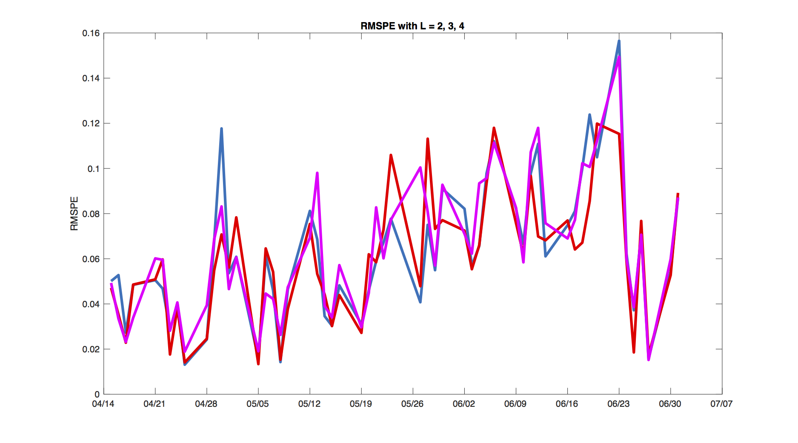

[](http://quantlet.de/)

## [](http://quantlet.de/) **LETFRMSPE** [](http://quantlet.de/)

```yaml

Name of Quantlet : LETFRMSPE

Published in : Leveraged ETF options implied volatility paradox

Description : 'Computes and plots the root mean squared prediction error of the dynamic
one-step-ahead forecast of the implied volatility surface of the SPY LETF call option. The
estimation of the dynamic semiparametric factor model with B-spline basis is performed for this
purpose'

Keywords : 'DSFM, dynamic, semiparametric, semiparametric model, pca, principal-component-analysis,
factor, factor-model, spline, basis, option, implied-volatility, surface, Newton, forecast, average
squared error'

See also : LETFFactorFuncs, LETFStochLoads, LETFIVSurfPlot

Author : Sergey Nasekin

Submitted : 2017/01/16

Datafile : SPYFULL.mat, SSOFULL.mat, yrates1415.mat

Input: 
- Km: B-spline order in moneyness direction
- Kt: B-spline order in time-to-maturity direction
- dim_mon: number of grid points for estimation in moneyness direction
- dim_ttm: number of grid points for estimation in time-to-maturity direction
- ikmon: parameter for setting the number of B-spline knots in moneyness direction
- ikttm: parameter for setting the number of B-spline knots in time-to-maturity direction
- tol: convergence tolerance for the Newton method
- maxiter: maximal number of iterations for the Newton method
- L: number of factor functions in the model
- lower_mon: lowest moneyness value to keep in the dataset
- upper_mon: highest moneyness value to keep in the dataset

Output : 'plot of the root mean squared prediction error for 3 different factor dimensions:
L=2,3,4'

```




### MATLAB Code:
```matlab
%% LOAD AND PREPARE DATA
clc
clear
close all

%Pre-set model parameters
Km         = 3; %spline order for moneyness direction
Kt         = 3;
dim_mon    = 70;
dim_ttm    = 70;
ikmon      = 5;
ikttm      = 3;
tol        = 1e-06;
maxiter    = 100;
L          = 3;
lower_mon  = 0.5;
upper_mon  = 1;

%Load data for SPY, SSO options and the Treasury yield curve data 
load SPYFULL 
load SSOFULL
load yrates1415

SPY = SPYtomatlab;
SSO = SSOtomatlab;

SPYdate_data    = SPYtomatlab.t;
SSOdate_data    = SSOtomatlab.t;
SSOprice_data   = SSOtomatlab.C;

SPYdates        = unique(SPYdate_data);
SSOdates        = unique(SSOdate_data);
[BothDates,ind] = intersect(SSOdates,SPYdates);

SPYIV = [SPY.TTM,SPY.LM,SPY.k_f,SPY.IV,SPY.t,SPY.K,SPY.L_t,SPY.r,SPY.C];
SSOIV = [SSO.TTM,SSO.LM,SSO.IV,SSO.t,SSO.K,SSO.L_t,SSO.r,SSO.C,SSO.T];

SSOIND = [];
for i = 1:length(ind)
    ssoind = find(SSOdate_data == BothDates(ind(i)));
    SSOIND = [SSOIND;ssoind]; %#ok<AGROW>
end

SPYIND = [];
for i = 1:length(ind)
    spyind = find(SPYdate_data == BothDates(ind(i)));
    SPYIND = [SPYIND;spyind]; %#ok<AGROW>
end

SPYIV = SPYIV(SPYIND,:);
SSOIV = SSOIV(SSOIND,:);

date_data = SPYIV(:,5);
Dates     = unique(date_data);
DatNum    = datenum(date_data); 
MATNUM    = [0; find(diff(DatNum) ~= 0)];
T         = length(MATNUM);
ttm_data  = SPYIV(:,1);
mon_data  = SPYIV(:,2);

%remove duplicates
IVCLEAN = [];
for i = 1:T
    %obtain data for each J_t
    if i == length(MATNUM)
        ind    = MATNUM(i)+1:length(mon_data);
        TTM_Jt = ttm_data(ind);
    else
        ind    = MATNUM(i)+1:MATNUM(i+1);
        TTM_Jt = ttm_data(ind);
    end
    
    DataMtx  = SPYIV(ind,:); 
    intmtn   = [0; find(diff(TTM_Jt) ~= 0)];
    DUMTX    = [];
    
    for j = 1:length(intmtn)
    
        if j == length(intmtn)
            PaDaMtx = DataMtx(intmtn(j)+1:end,:);
        else
            PaDaMtx = DataMtx(intmtn(j)+1:intmtn(j+1),:);
        end
        
        % extract the unique matrix for the step i
        ColStrike      = 6;  
        DataCol        = PaDaMtx(:,ColStrike);
        [~,indun,~]    = unique(DataCol);
        DataUMtx       = PaDaMtx(indun,:);
        DUMTX          = [DUMTX;DataUMtx];
    end
    
    IVCLEAN = [IVCLEAN;DUMTX];
end


MONDATA   = IVCLEAN(:,3);
MonReduc  = round(MONDATA,1);
IVCLEAN   = IVCLEAN(MonReduc <= upper_mon & MonReduc >= lower_mon,:);
TTM_DATA  = IVCLEAN(:,1);
TtmReduc  = round(TTM_DATA,1);
IVCLEAN   = IVCLEAN(TtmReduc <= 1,:);
date_data = IVCLEAN(:,5);
Dates     = unique(date_data);
DatNum    = datenum(date_data); 
MATNUM    = [0; find(diff(DatNum) ~= 0)];
T         = length(MATNUM);
TTM_DATA  = IVCLEAN(:,1);

%TRUE INTEREST RATE CALCULATION
[~,rind,~] = intersect(yrates1415(:,1),Dates);
RATEMAT    = yrates1415(rind,2:6);
maturs     = [1/12,3/12,6/12,1,2];

%calculate risk-free interest rates for each maturity 
RATES = [];
for i = 1:T
    %obtain data for each J_t
    if i == length(MATNUM)
        ind    = MATNUM(i)+1:length(TTM_DATA);
        TTM_Jt = TTM_DATA(ind);
    else
        ind    = MATNUM(i)+1:MATNUM(i+1);
        TTM_Jt = TTM_DATA(ind);
    end
    
    rates = RATEMAT(i,:)./100; 
    R_Jt  = interp1(maturs,rates,TTM_Jt,'pchip');
    
    RATES = [RATES;R_Jt];
end

IVCLEAN(:,8) = RATES;

% obtain the new "tracking matrix"
MONDATA   = IVCLEAN(:,3);
IVDATA    = IVCLEAN(:,4);
MonReduc  = round(MONDATA,1);
IVCLEAN   = IVCLEAN(MonReduc <= upper_mon & MonReduc >= lower_mon,:);
TTM_DATA  = IVCLEAN(:,1);
TtmReduc  = round(TTM_DATA,1);
IVCLEAN   = IVCLEAN(TtmReduc <= 1,:);

MONDATA   = IVCLEAN(:,2);
IVDATA    = IVCLEAN(:,4);
date_data = IVCLEAN(:,5);
DATES     = unique(date_data);
DatesStr  = datestr(date_data);
DatNum    = datenum(date_data); 
MATNUM    = [0; find(diff(DatNum) ~= 0)];
T         = length(MATNUM);
iv_data   = IVCLEAN(:,4);
TTM_DATA  = IVCLEAN(:,1);


for i = 1:length(date_data)
    if DatesStr(i,end) == '4'
        DatesStr(i,8:end) = '2014';
    else
        DatesStr(i,8:end) = '2015';
    end
end

IVCLEAN(:,5) = datenum(DatesStr);

% calculate days' breaks vector
JTT = zeros(1,T); 
for i = 1:T
    if i == T
        ind    = MATNUM(i)+1:length(TTM_DATA);
        Jt     = length(ind);        
    else
        ind    = MATNUM(i)+1:MATNUM(i+1);
        Jt     = length(ind);
    end
    JTT(i) = Jt;
end

wshift = 0;
wwidth = 100;

%% MAIN LOOP OF THE ROLLING-WINDOW STRATEGY
RMSPE      = zeros(1,T-wwidth);
RMSPEShort = zeros(1,T-wwidth);
TTMT       = zeros(1,T-wwidth);
IVStrs     = cell(1,T-wwidth); 

for l = wwidth:T-1 
    %construct the rolling-window dataset
    %for estimation    
    IVMAT       = IVCLEAN(1+wshift:MATNUM(l),:);
    date_data   = IVMAT(:,5);
    Dates       = unique(date_data);
    DatNum      = datenum(date_data); 
    matnum      = [0; find(diff(DatNum) ~= 0)]; %this is another, rolling-window
    Tw          = length(matnum);               %tracking matrix
    ttm_data    = IVMAT(:,1);
    mon_data    = IVMAT(:,2);
    iv_data     = IVMAT(:,4);
    
    % Marginally transform TTM data (because DSFM theory works 
    % only on the interval (0,1) for the covariates!) 
    ttm_data    = ksdensity(ttm_data,ttm_data,'function','cdf');
    %marginally transform MON data (the same reason as above!)
    mon_data    = ksdensity(mon_data,mon_data,'function','cdf');
    
    %Produce knots' sequences for B-spline estimation
    knots_mon   = [min(mon_data),min(mon_data),linspace(min(mon_data),...
        max(mon_data),ikmon),max(mon_data),max(mon_data)];
    knots_ttm   = [min(ttm_data),min(ttm_data),linspace(min(ttm_data),...
        max(ttm_data),ikttm),max(ttm_data),max(ttm_data)];
    
    KK  = (length(knots_mon)-Km)*(length(knots_ttm)-Kt);

    PHI = cell(1,Tw);
    YY  = cell(1,Tw);
    JT  = zeros(1,Tw); 
    
    %construct the Phi matrices for the rolling window
    for i = 1:Tw
        %obtain data for each J_t
        if i == length(matnum)
            ind    = matnum(i)+1:length(mon_data);
            MON_Jt = mon_data(ind);
            Jt     = length(MON_Jt);
            TTM_Jt = ttm_data(ind);
            IV_Jt  = iv_data(ind);
        else
            ind    = matnum(i)+1:matnum(i+1);
            Jt     = length(ind);
            MON_Jt = mon_data(ind);
            TTM_Jt = ttm_data(ind);
            IV_Jt  = iv_data(ind);
        end
        JT(i) = Jt;

        %estimate splines
        UMON_Jt = unique(MON_Jt);
        UTTM_Jt = unique(TTM_Jt);
        MonMat  = spcol(knots_mon,Km,UMON_Jt);
        TtmMat  = spcol(knots_ttm,Kt,UTTM_Jt);
        Phi     = zeros(KK, Jt);
        for j = 1:Jt
            ind_mon  = find(UMON_Jt == MON_Jt(j));
            ind_ttm  = find(UTTM_Jt == TTM_Jt(j));
            combin   = combvec(MonMat(ind_mon,:), TtmMat(ind_ttm,:)); 
            Phi(:,j) = prod(combin,1);       
        end
        PHI{i} = Phi;
        YY{i}  = IV_Jt;
    end
    
    %CREATE STARTING VALUES FOR Z
    CoefMat2   = [0.95  0;
                  0.2  -0.3];
    
    CoefMat3   = [0.95 -0.2 0;
                  0     0.8 0.1;
                  0.1   0   0.6];
              
    CoefMat4   = [0.8 -0.2  0    0.3;
                  0    0.8  0.1 -0.3 ;
                  0.1  0   -0.3  0.2;
                 -0.7 -0.5  0.6  0];
             
    switch L
        case 2
            CoefMat = CoefMat2;
        case 3
            CoefMat = CoefMat3;
        case 4
            CoefMat = CoefMat4;
    end

    varspec    = vgxset('n',L,'nAR',1,'AR',CoefMat,'Q',10e-5.*eye(L));
    Zeta_start = vgxsim(varspec,Tw);

    Cmat       = eye(L) - (1/L)*ones(L,1)*ones(1,L); %centering matrix
    Zeta_start = Zeta_start*Cmat; %set means to zero
    Zeta_start = Zeta_start';
    Zeta_start(2,50) = -0.0037;
    rank(Zeta_start)
        
    %%%%%%%%%%%%%%%%%%%%%%%%%%%%%%%%%%%%%%%%%%%%%%%%%%%%%%%%%%%%%%%%%%%%%%%
    %LOOPING WITH RE-TRIALS IN THE CASE OF NON-CONVERGENCE
    %%%%%%%%%%%%%%%%%%%%%%%%%%%%%%%%%%%%%%%%%%%%%%%%%%%%%%%%%%%%%%%%%%%%%%%
    count     = 0;
    err_count = 0;
    while count == err_count
        try 
        %Compute starting values for Newton iterations
        L           = size(Zeta_start,1);
        ZETA_start  = reshape(Zeta_start,L*Tw,1).*100000;
        %set up the initial guess solution
        alpha_start = rand(KK*(L+1),1);
        SOL_OLD     = [alpha_start;ZETA_start];
        diffV       = 10; % make sure the loop runs at least once
        iter        = 0;
        
        %THE NEWTON LOOP

        while (diffV > tol)
            if iter > maxiter
                error('DSFM_RMSE:maxiter','The algorithm does not converge with the given maximum number of iterations')
            end

            alpha = SOL_OLD(1:KK*(L+1),1);
            ZETA  = SOL_OLD(KK*(L+1)+1:end,1);
            Zeta  = [ones(1,Tw);reshape(ZETA,L,Tw)];
            Alpha = reshape(alpha,L+1,KK);
            AA    = Alpha(2:end,:); 
            first_el     = zeros(KK*(L+1),Tw);
            secd_el      = zeros(KK*(L+1),Tw);
            first_el_noa = zeros(KK*(L+1),KK*(L+1),Tw);
            F01          = cell(Tw,1);
            F02          = zeros(Tw*L);
            II = [zeros(1,L);eye(L)];
            F11          = cell(1,Tw);
            for i = 1:Tw
                first_el(:,i)       = kron( PHI{i}*PHI{i}', Zeta(:,i)*Zeta(:,i)' )*alpha;
                secd_el(:,i)        = kron( PHI{i}*YY{i}, Zeta(:,i)); 
                first_el_noa(:,:,i) = kron( PHI{i}*PHI{i}', Zeta(:,i)*Zeta(:,i)' );
                F01{i}              = ( Zeta(:,i)'*Alpha*PHI{i}*PHI{i}'*AA' - YY{i}'*PHI{i}'*AA' )';
                f02                 = zeros(Tw);
                f02(i,i)            = 1;
                f02_block           = AA*PHI{i}*PHI{i}'*AA';
                f02_kron            = kron(f02,f02_block);
                F02                 = F02 + f02_kron;

                F11{i}              = kron( PHI{i}*PHI{i}'*AA',Zeta(:,i) ) + kron( PHI{i}*PHI{i}'*Alpha'*Zeta(:,i), II ) ...
                                      - kron( PHI{i}*YY{i}, II);
            end

            F10   = 2.*(sum(first_el,2) - sum(secd_el,2));
            F20   = 2.*(sum(first_el_noa,3));
            F01   = 2.*cell2mat(F01);
            F11   = 2.*cell2mat(F11);
            FBIG  = [F10;F01];
            DFBIG = [F20, F11;
                     F11',F02];

            %compute the solution iteration
            SOL_NEW = SOL_OLD - (pinv(DFBIG))*FBIG;
            diffV   = max(abs(SOL_NEW - SOL_OLD))
            SOL_OLD = SOL_NEW;
            iter    = iter + 1
        end
        catch err    
            %Re-simulate starting values for Z in the case of
            %non-convergence
            varspec    = vgxset('n',L,'nAR',1,'AR',CoefMat,'Q',10e-5.*eye(L));
            Zeta_start = vgxsim(varspec,Tw);
            Cmat       = eye(L) - (1/L)*ones(L,1)*ones(1,L); %centering matrix
            Zeta_start = Zeta_start*Cmat; %set means to zero
            Zeta_start = Zeta_start';
            Zeta_start(2,50) = -0.0037;
            rank(Zeta_start)
            err_count = err_count + 1;
        end
        count = count + 1;
    end
 
    %%%%%%%%%%%%%%%%%%%%%%%%%%%%%%%%%%%%%%%%%%%%%%%%%%%%%%%%%%%%%%%%%%%%%%%
    %END OF LOOPING WITH RE-TRIALS
    %%%%%%%%%%%%%%%%%%%%%%%%%%%%%%%%%%%%%%%%%%%%%%%%%%%%%%%%%%%%%%%%%%%%%%%
    
    SOL_FIN = SOL_NEW;
    ALPHA   = SOL_FIN(1:KK*(L+1),1);
    ZZETA   = SOL_FIN(KK*(L+1)+1:end,1);
    ALPHA   = reshape(ALPHA,L+1,KK);
    mongrid = linspace(min(mon_data),max(mon_data),dim_mon);
    ttmgrid = linspace(min(ttm_data),max(ttm_data),dim_ttm);
    
    MONMAT  = spcol(knots_mon,Km,mongrid);
    TTMMAT  = spcol(knots_ttm,Kt,ttmgrid);
    COEF    = zeros(length(knots_mon)-Km,length(knots_ttm)-Kt,L+1);
    MHAT    = zeros(length(mongrid),length(ttmgrid),L+1);

    for i = 1:L+1
        COEF(:,:,i)   = reshape(ALPHA(i,:)',length(knots_mon)-Km,length(knots_ttm)-Kt);
        %obtain the estimated factor functions
        MHAT(:,:,i)   = MONMAT*COEF(:,:,i)*TTMMAT';
    end

    %Norming and orthogonalization of factor functions mhat and
    %coefficients zeta
    du                   = (mongrid(2)-mongrid(1))*(ttmgrid(2)-ttmgrid(1));
    tempmat              = 0*MHAT(:,:,1)+1;
    tempmat(2:(end-1),:) = 2*tempmat(2:(end-1),:);
    tempmat(:,2:(end-1)) = 2*tempmat(:,2:(end-1));

    %Norming matrices 
    GAMMA = zeros(L);
    gamma = zeros(L,1);


    %Numeric integration
    for i = 1:L
        gamma(i)       = sum(sum(tempmat.*MHAT(:,:,1).*MHAT(:,:,i+1)))*du/4;
        for j = 1:L
            GAMMA(i,j) = sum(sum(tempmat.*MHAT(:,:,j+1).*MHAT(:,:,i+1)))*du/4;
        end
    end

    %Vectorize factor functions
    MHATMat            = zeros(size(MHAT(:,:,1),1)*size(MHAT(:,:,1),2),L+1);
    for i = 1:(L+1)
          MHATMat(:,i) = reshape(MHAT(:,:,i),size(MHAT(:,:,1),1)*size(MHAT(:,:,1),2),1); 

    end

    %Obtain normed coefficients Zeta (as in Fengler, p. 166, eq. 5.74)
    Zeta_new = zeros(L,Tw);
    Zeta_est = reshape(ZZETA,L,Tw);
    for i = 1:Tw
        Zeta_new(:,i) = (GAMMA^0.5)*( Zeta_est(:,i) + (GAMMA^(-1))*gamma );
    end

    MHATMatZero  = MHATMat(:,1)' -gamma'*GAMMA^(-1)*MHATMat(:,2:end)';
    MHATMatShort = GAMMA^(-0.5)*MHATMat(:,2:end)';

    %Create the B matrix for PCA transformation
    B        = Zeta_new*Zeta_new';
    [Z,~]    = eigs(B,L);
    ZETA_FIN = zeros(L,Tw);

    for i = 1:Tw
        ZETA_FIN(:,i) = Z'*Zeta_new(:,i);
    end

    MHATMatFin = Z'*MHATMatShort;
    MHATMatFin = MHATMatFin';


    %Obtain final factor functions 
    MHAT_FIN = zeros(size(MHAT(:,:,1),1), size(MHAT(:,:,1),2), L+1);
    for i = 1:L+1
        if i == 1
            MHAT_FIN(:,:,i) = reshape(MHATMatZero, size(MHAT(:,:,1),1),...
                size(MHAT(:,:,1),2));
            continue
        end
        MHAT_FIN(:,:,i) = reshape(MHATMatFin(:,i-1), size(MHAT(:,:,1),1),...
            size(MHAT(:,:,1),2));  
    end
    
    %Produce dynamic IV surfaces
    IV_DYN = zeros(size(MHAT(:,:,1),1), size(MHAT(:,:,1),2), Tw);
    for t = 1:Tw
        IV_DYN(:,:,t) = MHAT_FIN(:,:,1);
        for ll = 1:L
            IV_DYN(:,:,t) = IV_DYN(:,:,t) + ZETA_FIN(ll,t).*MHAT_FIN(:,:,ll+1);
        end      
    end
    
    %NOW FORECAST THE IV_DYN AND TAKE OUT THE NECESSARY "STRING" OF IVs
    numLags   = 3;
    Z         = ZETA_FIN';
    ZPreSamp  = Z(1:numLags,:);
    ZSamp     = Z(numLags+1:end,:);
    VARSpec   = vgxvarx(vgxset('n',L,'Constant',true,'nAR',numLags),...
                      ZSamp,[],ZPreSamp); %no exogenous inputs here!              
    horizon   = 1;
    ForecastZ = vgxpred(VARSpec,horizon,[],Z);
    
    %obtain the forecasted IV surface
    IVDF      = MHAT_FIN(:,:,1);
    for ll = 1:L
        IVDF  = IVDF + ForecastZ(ll).*MHAT_FIN(:,:,ll+1);
    end
    
    
    %CALCULATING THE REAL-DATA NEXT-DAY IV FOR THE RMSPE
    DatMat_R  = [MONDATA(MATNUM(l)+1:MATNUM(l+1)),...
                 IVDATA(MATNUM(l)+1:MATNUM(l+1)),...
                 TTM_DATA(MATNUM(l)+1:MATNUM(l+1))];    

    %RMSE CALCULATION PART
    TTM_t_R   = round(TTM_DATA(MATNUM(l)+1:MATNUM(l+1)),1);
    TUt       = unique(TTM_t_R);
    
    %Calculate the array of all real and forecast (sorted) IVs and (transformed and sorted) log-moneyness 
    allIVLM   = cell(length(TUt),1);
    for i = 1:length(TUt)
        LM_t_R     = DatMat_R(TTM_t_R == TUt(i),1);
        IV_t_R     = DatMat_R(TTM_t_R == TUt(i),2); 
        LMt_Sc_R   = ksdensity(IVMAT(:,2),LM_t_R,'function','cdf');
        IVDF_Tgt_R = interp2(mongrid,ttmgrid,IVDF',LMt_Sc_R,TUt(i),'cubic');
        [LM_srtd_R,...
          ivind_R] = sort(LMt_Sc_R,'ascend');
        allivlm    = [LM_srtd_R';IVDF_Tgt_R(ivind_R);IV_t_R(ivind_R)'];
        allivlm    = allivlm(:,~any(isnan(allivlm),1));
        allIVLM{i} = allivlm;
    end
             
    
    %RMSPE CALCULATION
    Srmspe = zeros(1,length(TUt));
    Frmspe = zeros(1,length(TUt));
    SDivsr = 0;
    FDivsr = 0;
    for i = 1:length(TUt)
        ivm2     = allIVLM{i};
        ivt      = ivm2(2,:);
        ivr      = ivm2(3,:);
        if mod(length(ivt),2) == 0
            dp = length(ivt)/2 + 1; 
        else
            dp = ( length(ivt) + 1 )/2;
        end
        Srmspe(i) = sum((ivt(dp:end) - ivr(dp:end)).^2);
        Frmspe(i) = sum((ivt - ivr).^2);
        SDivsr    = SDivsr + length(ivt(dp:end));
        FDivsr    = FDivsr + length(ivt);
    end
    
    Srmspe = sqrt((1/SDivsr)*sum(Srmspe));
    Frmspe = sqrt((1/FDivsr)*sum(Frmspe));
    
    RMSPE(l-wwidth+1)      = Frmspe;
    RMSPEShort(l-wwidth+1) = Srmspe;
    TTMT(l-wwidth+1)       = max(TUt);
    IVStrs{l-wwidth+1}     = allIVLM;

    wshift = wshift + JTT(l-wwidth+1); 
end

%% RMSPE plots

%{ 
To plot this figure, you need to run the code above for L = 2,3,4
and save the RMSPE arrays as RMSPE2, RMSPE3, RMSPE4, respectively
%}
rfig = figure;
plot(DATES(wwidth+1:end,:), RMSPE2, 'LineWidth', 3)
hold on
plot(DATES(wwidth+1:end,:), RMSPE3, 'LineWidth', 3, 'Color', 'r')
plot(DATES(wwidth+1:end,:), RMSPE4, 'LineWidth', 3, 'Color', 'm')
datetick('x')
ylabel('RMSPE')
title('RMSPE with L = 2, 3, 4')
set(rfig, 'Position', [10 10 900 500])
hold off


           
```
