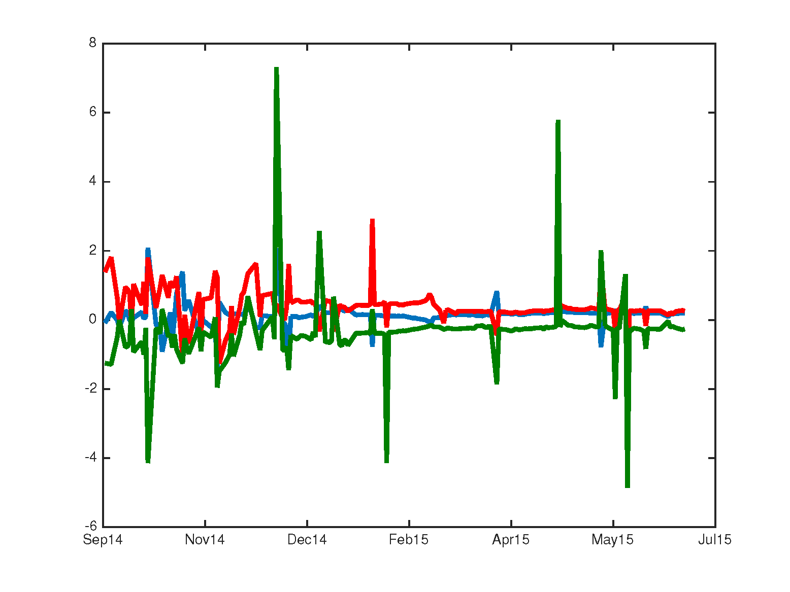

[](http://quantlet.de/index.php?p=info)

## [](http://quantlet.de/) **LETFStochLoads** [](http://quantlet.de/d3/ia)

```yaml

Name of Quantlet : LETFStochLoads

Published in : Leveraged ETF options implied volatility paradox

Description : 'Compute and plot the dynamics of stochastic factor loadings of the SPY LETF option
implied volatility surface. The estimation of the dynamic semiparametric factor model with B-spline
basis is performed for this purpose'

Keywords : 'DSFM, dynamic, semiparametric, semiparametric model, pca, principal-component-analysis,
factor, factor-model, spline, basis, option, implied-volatility, surface, Newton'

See also : LETFFactorFuncs, LETFIVTrueMonsc

Author : Sergey Nasekin

Submitted : 2016/01/19

Datafile : SPYDATA.mat

Input: 
- Km: B-spline order in moneyness direction
- Kt: B-spline order in time-to-maturity direction
- dim_mon: number of grid points for estimation in moneyness direction
- dim_ttm: number of grid points for estimation in time-to-maturity direction
- ikmon: parameter for setting the number of B-spline knots in moneyness direction
- ikttm: parameter for setting the number of B-spline knots in time-to-maturity direction
- tol: convergence tolerance for the Newton method
- maxiter: maximal number of iterations for the Newton method
- L: number of factor functions in the model

Output : plot of stochastic factor loadings of the SPY LETF option implied volatility surface

```




```matlab
%% LOAD DATA AND SET PARAMETERS

%Clear workspace and close all windows 
clc
clear
close all

%Load the SPY option dataset
load SPYDATA

%Set the model parameters
Km      = 3;
Kt      = 3;
dim_mon = 60;
dim_ttm = 60;
ikmon   = 5;
ikttm   = 3;
tol     = 1e-07;
maxiter = 100000;
h       = 1e-06;
L       = 3;
%% DSFM MODEL ESTIMATION

IVDATA    = SPYDATA;
ttm_data  = IVDATA(:,1);
mon_data  = IVDATA(:,2);
iv_data   = IVDATA(:,3);
date_data = IVDATA(:,4);
Dates     = unique(date_data);
DatNum    = datenum(date_data); 
matnum    = [0; find(diff(DatNum) ~= 0)];
T         = length(matnum);

%Marginally transform data
ttm_data  = ksdensity(ttm_data,ttm_data,'function','cdf');
mon_data  = ksdensity(mon_data,mon_data,'function','cdf');

%Produce knots' sequences for B-spline estimation 
knots_mon = [min(mon_data),min(mon_data),linspace(min(mon_data),max(mon_data),ikmon),max(mon_data),max(mon_data)];
knots_ttm = [min(ttm_data),min(ttm_data),linspace(min(ttm_data),max(ttm_data),ikttm),max(ttm_data),max(ttm_data)];

%Determine the number of B-spline sites
KK        = (length(knots_mon)-Km)*(length(knots_ttm)-Kt);

%Obtain B-spline collocation matrices for model estimation
PHI       = cell(1,T);
YY        = cell(1,T);
JT        = zeros(1,T); 

for i = 1:T
    %obtain data for each J_t
    if i == length(matnum)
        ind    = matnum(i)+1:length(mon_data);
        MON_Jt = mon_data(ind);
        Jt     = length(MON_Jt);
        TTM_Jt = ttm_data(ind);
        IV_Jt  = iv_data(ind);
    else
        ind    = matnum(i)+1:matnum(i+1);
        Jt     = length(ind);
        MON_Jt = mon_data(ind);
        TTM_Jt = ttm_data(ind);
        IV_Jt  = iv_data(ind);
    end
    JT(i) = Jt;
        
    %estimate collocation matrices
    UMON_Jt = unique(MON_Jt);
    UTTM_Jt = unique(TTM_Jt);
    MonMat  = spcol(knots_mon,Km,UMON_Jt);
    TtmMat  = spcol(knots_ttm,Kt,UTTM_Jt);
    Phi     = zeros(KK, Jt);
    for j = 1:Jt
        ind_mon  = find(UMON_Jt == MON_Jt(j));
        ind_ttm  = find(UTTM_Jt == TTM_Jt(j));
        combin   = combvec(MonMat(ind_mon,:), TtmMat(ind_ttm,:));
        Phi(:,j) = prod(combin,1);       
    end
    PHI{i} = Phi;
    YY{i}  = IV_Jt;
end

%Set up the initial guess solution

%create starting values for stochastic loadings Z
CoefMat3   = [0.95 -0.2 0;
              0     0.8 0.1;
              0.1   0   0.6];
          
%simulate time series          
varspec    = vgxset('n',L,'nAR',1,'AR',CoefMat3,'Q',10e-5.*eye(L));
Zeta_start = vgxsim(varspec,T);
Cmat       = eye(L) - (1/L)*ones(L,1)*ones(1,L);
Zeta_start = Zeta_start*Cmat;
Zeta_start = Zeta_start';

%ensure the full row rank is fulfilled
Zeta_start(2,50) = -0.0037;
rank(Zeta_start)

ZETA_start  = reshape(Zeta_start,L*T,1).*100000;
alpha_start = rand(KK*(L+1),1);
SOL_OLD     = [alpha_start;ZETA_start];

diffV = 10; % make sure the loop runs at least once
iter  = 0;

%Run the Newton loop
while (diffV > tol)
    
    if iter > maxiter
        error('LETFStochLoads:maxiter','The algorithm does not converge with the given maximum number of iterations')
    end
    
    alpha        = SOL_OLD(1:KK*(L+1),1);
    ZETA         = SOL_OLD(KK*(L+1)+1:end,1);
    Zeta         = [ones(1,T);reshape(ZETA,L,T)];   
    Alpha        = reshape(alpha,L+1,KK);
    AA           = Alpha(2:end,:); 
    first_el     = zeros(KK*(L+1),T);
    secd_el      = zeros(KK*(L+1),T);
    first_el_noa = zeros(KK*(L+1),KK*(L+1),T);
    F01          = cell(T,1);
    F02          = zeros(T*L);
    II           = [zeros(1,L);eye(L)];
    F11          = cell(1,T);
    for i = 1:T
        first_el(:,i)       = kron( PHI{i}*PHI{i}', Zeta(:,i)*Zeta(:,i)' )*alpha;
        secd_el(:,i)        = kron( PHI{i}*YY{i}, Zeta(:,i)); 
        first_el_noa(:,:,i) = kron( PHI{i}*PHI{i}', Zeta(:,i)*Zeta(:,i)' );
        F01{i}              = ( Zeta(:,i)'*Alpha*PHI{i}*PHI{i}'*AA' - YY{i}'*PHI{i}'*AA' )';
        f02                 = zeros(T);
        f02(i,i)            = 1;
        f02_block           = AA*PHI{i}*PHI{i}'*AA';
        f02_kron            = kron(f02,f02_block);
        F02                 = F02 + f02_kron;

        F11{i}              = kron( PHI{i}*PHI{i}'*AA',Zeta(:,i) ) + kron( PHI{i}*PHI{i}'*Alpha'*Zeta(:,i), II ) ...
                              - kron( PHI{i}*YY{i}, II);
    end

    F10   = 2.*(sum(first_el,2) - sum(secd_el,2));
    F20   = 2.*(sum(first_el_noa,3));
    F01   = 2.*cell2mat(F01);
    F11   = 2.*cell2mat(F11);
    FBIG  = [F10;F01];
    DFBIG = [F20, F11;
             F11',F02];
    

    SOL_NEW = SOL_OLD - (pinv(DFBIG))*FBIG;   
    diffV   = max(abs(SOL_NEW - SOL_OLD))
    SOL_OLD = SOL_NEW;
    iter    = iter + 1
end

%Obtain the (unnormed) estimates
SOL_FIN = SOL_NEW;
ALPHA   = SOL_FIN(1:KK*(L+1),1);
ZZETA   = SOL_FIN(KK*(L+1)+1:end,1);
ALPHA   = reshape(ALPHA,L+1,KK);

%Define grids for estimation
mongrid = linspace(min(mon_data),max(mon_data),dim_mon);
ttmgrid = linspace(min(ttm_data),max(ttm_data),dim_ttm);

%Reshape the estimates 
MONMAT  = spcol(knots_mon,Km,mongrid);
TTMMAT  = spcol(knots_ttm,Kt,ttmgrid);
COEF    = zeros(length(knots_mon)-Km,length(knots_ttm)-Kt,L+1);
MHAT    = zeros(length(mongrid),length(ttmgrid),L+1);

for i = 1:L+1
    COEF(:,:,i) = reshape(ALPHA(i,:)',length(knots_mon)-Km,length(knots_ttm)-Kt);
    %obtain the estimated factor functions
    MHAT(:,:,i) = MONMAT*COEF(:,:,i)*TTMMAT';
end

%Orthonormalize factor functions and factor loadings
du                   = (mongrid(2)-mongrid(1))*(ttmgrid(2)-ttmgrid(1));
tempmat              = 0*MHAT(:,:,1)+1;
tempmat(2:(end-1),:) = 2*tempmat(2:(end-1),:);
tempmat(:,2:(end-1)) = 2*tempmat(:,2:(end-1));

%Norming matrices 
GAMMA = zeros(L);
gamma = zeros(L,1);

%Numeric integration
for i = 1:L
    gamma(i) = sum(sum( tempmat.*MHAT(:,:,1).*MHAT(:,:,i+1) ))*du/4;
    for j = 1:L
        GAMMA(i,j) = sum(sum(tempmat.*MHAT(:,:,j+1).*MHAT(:,:,i+1)))*du/4;
    end
end

%Vectorize factor functions
MHATMat = zeros(size(MHAT(:,:,1),1)*size(MHAT(:,:,1),2),L+1);
for i = 1:(L+1)
      MHATMat(:,i) = reshape(MHAT(:,:,i),size(MHAT(:,:,1),1)*size(MHAT(:,:,1),2),1); 

end

%Obtain normed coefficients zeta 
Zeta_new = zeros(L,T);
Zeta_est = reshape(ZZETA,L,T);
for i = 1:T
    Zeta_new(:,i) = (GAMMA^0.5)*( Zeta_est(:,i) + (GAMMA^(-1))*gamma );
end

MHATMatZero  = MHATMat(:,1)' -gamma'*GAMMA^(-1)*MHATMat(:,2:end)';
MHATMatShort = GAMMA^(-0.5)*MHATMat(:,2:end)';
B            = Zeta_new*Zeta_new';
[Z,~]        = eigs(B,L);
ZETA_FIN     = zeros(L,T);

for i = 1:T
    ZETA_FIN(:,i) = Z'*Zeta_new(:,i);
end

%% LOADINGS' PLOTTING
linewidth = 3;
plot(Dates,ZETA_FIN(1,:), 'LineWidth',linewidth)
hold on
datetick('x','mmmyy','keepticks')
plot(Dates,ZETA_FIN(2,:),'Color','r', 'LineWidth',linewidth)
plot(Dates,ZETA_FIN(3,:),'Color',[0,.5,0], 'LineWidth',linewidth)

```
